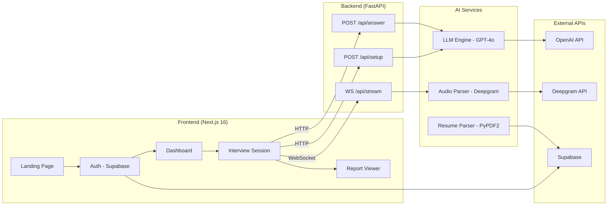
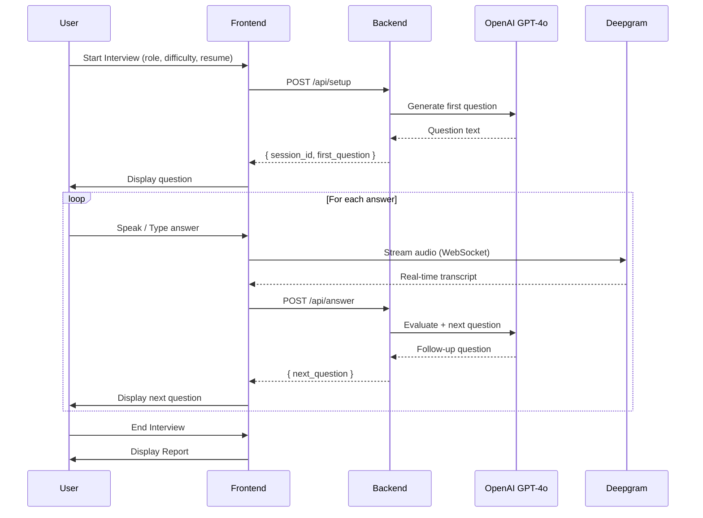

# PreMock AI — Architecture

## System Overview

## Interview Flow

## Key Design Decisions

| Decision | Rationale |
|----------|-----------|
| **Fallback question banks** | If OpenAI API is unavailable/quota exceeded, the engine serves curated questions from a static bank per role and difficulty — ensuring 100% uptime. |
| **In-memory sessions** | Active interview sessions are stored in-memory for low-latency access. Acceptable for MVP; future work: Redis-backed sessions. |
| **Supabase for Auth + Storage** | Single platform for authentication (Google OAuth) and resume PDF storage, reducing infrastructure complexity. |
| **WebSocket for audio** | Real-time speech-to-text requires low-latency bidirectional communication; WebSocket is the natural choice over HTTP polling. |

## Deployment Topology

| Service | Platform | URL |
|---------|----------|-----|
| Frontend | Vercel | `premock.vercel.app` |
| Backend | Railway / Render | `api.premock.ai` |
| Database + Auth | Supabase | Managed |
| AI | OpenAI API | Managed |
| Speech | Deepgram API | Managed |
